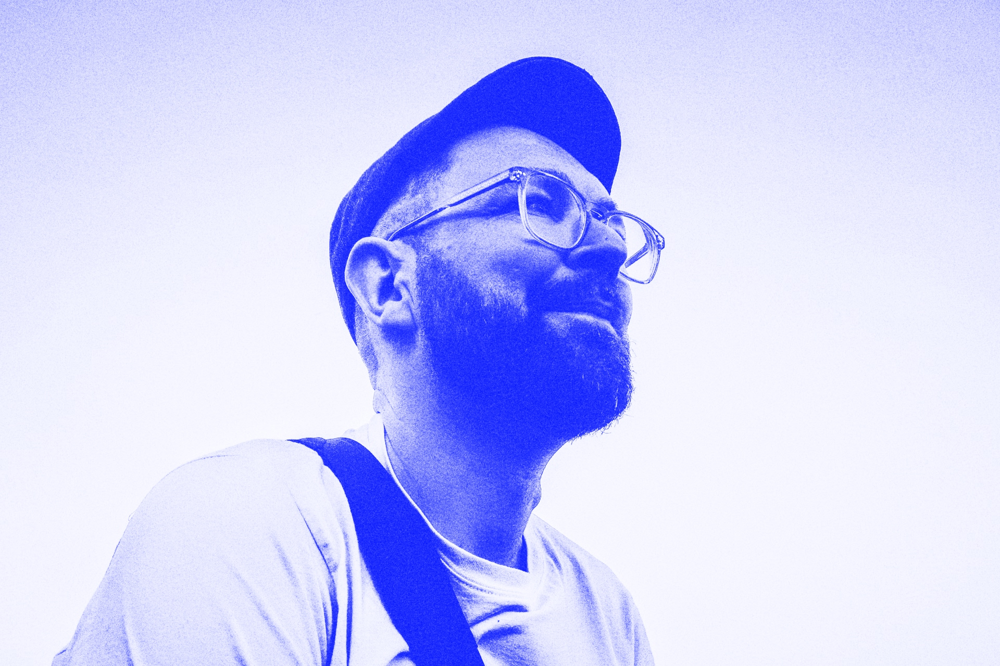

# Hey there 👋 I'm Barry.

I'm a <mark>dedicated</mark>, <mark>pragmatic</mark> and <mark>light-hearted</mark> UX designer with **over +15 years designing products and services** that create better outcomes for businesses *and* customers.

I'm at my best collaborating with creative and thoughtful people to find solutions to complex problems. My design process goes far beyond the visual to **improve human experiences** and **drive business growth**. My experience includes years **building teams**, **developing strategies**, **operationalising agile practices**, includind **scaling design systems**. 

> [!NOTE]  
> I am **open** to collaborations.

**[Let's Connect!](https://links.renderg.host/)**

**`#DesignOps` `#ProductDesign` `#ServiceDesign`**
